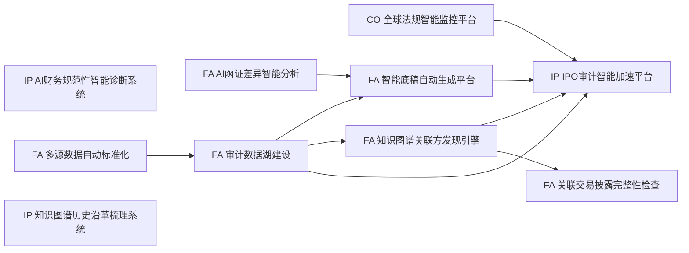

# 智能审计报告

> **审计需求**: 对拟上市企业进行IPO财务规范性审计，审查关联方识别、历史沿革、财务规范性和披露完整性  
> **生成时间**: 2026-08-08 21:12:12  
> **执行耗时**: 1.295s  
> **模块执行**: 10/10 成功  

## 一、执行摘要

| 指标 | 数值 |
|------|------|
| 选中模块数 | 10 |
| 数据流边数 | 9 |
| 模块成功数 | 10 |
| 模块失败数 | 0 |
| 审计发现总数 | 58 |
| 高风险发现 | 54 |
| 中风险发现 | 4 |
| 低风险发现 | 0 |

⚠️ **风险提示**: 本次审计发现 **54** 条高风险审计发现，建议立即关注并采取整改措施。

## 二、AI 规划推理

```
【LLM 需求理解】
需求聚焦拟上市企业的IPO财务规范性审计，重点包括关联方识别、历史沿革、财务规范性和披露完整性。因此选择关联方图谱发现（fa_10）和披露完整性检查（fa_12）处理关联方与披露，选择历史沿革梳理（ip_03）和财务规范性诊断（ip_04）覆盖历史与规范性，并以IPO审计加速平台（ip_01）进行综合加速。根据依赖关系，fa_10需要fa_03和fa_02作为数据基础，故自动补全。

【关键词】IPO审计, 财务规范性, 关联方识别, 历史沿革, 披露完整性
【LLM 选定模块】
  • fa_02(多源数据自动标准化) - 多源数据自动标准化，为关联方图谱和后续审计提供标准化数据
  • fa_03(审计数据湖建设) - 审计数据湖建设，存储和整合IPO审计所需的多维数据
  • fa_10(知识图谱关联方发现引擎) - 知识图谱关联方发现引擎，识别关联方关系及潜在风险
  • fa_12(关联交易披露完整性检查) - 关联交易披露完整性检查，确保IPO披露完整合规
  • ip_01(IPO审计智能加速平台) - IPO审计智能加速平台，整体协调审计流程并提速
  • ip_03(知识图谱历史沿革梳理系统) - 知识图谱历史沿革梳理系统，梳理公司历史沿革及股权变动
  • ip_04(AI财务规范性智能诊断系统) - AI财务规范性智能诊断系统，诊断财务处理是否符合规范
【自动补全上游依赖】
  • co_01(全球法规智能监控平台)
  • fa_06(AI函证差异智能分析)
  • fa_07(智能底稿自动生成平台)
【数据流】fa_02→fa_03, fa_03→fa_07, fa_03→fa_10, fa_03→ip_01, fa_06→fa_07, fa_07→ip_01, fa_10→ip_01, fa_10→fa_12, co_01→ip_01
【执行顺序】ip_04 → fa_02 → fa_06 → ip_03 → co_01 → fa_03 → fa_07 → fa_10 → ip_01 → fa_12
```

## 三、模块执行详情

| 序号 | 模块 | 名称 | 家族 | 状态 | 耗时(s) |
|------|------|------|------|------|---------|
| 1 | `ip_04` | AI财务规范性智能诊断系统 | IPO审计 | ✅ 成功 | 0.036 |
| 2 | `fa_02` | 多源数据自动标准化 | 财务审计 | ✅ 成功 | 0.173 |
| 3 | `fa_06` | AI函证差异智能分析 | 财务审计 | ✅ 成功 | 0.041 |
| 4 | `ip_03` | 知识图谱历史沿革梳理系统 | IPO审计 | ✅ 成功 | 0.073 |
| 5 | `co_01` | 全球法规智能监控平台 | 合规审计 | ✅ 成功 | 0.051 |
| 6 | `fa_03` | 审计数据湖建设 | 财务审计 | ✅ 成功 | 0.52 |
| 7 | `fa_07` | 智能底稿自动生成平台 | 财务审计 | ✅ 成功 | 0.074 |
| 8 | `fa_10` | 知识图谱关联方发现引擎 | 财务审计 | ✅ 成功 | 0.054 |
| 9 | `ip_01` | IPO审计智能加速平台 | IPO审计 | ✅ 成功 | 0.207 |
| 10 | `fa_12` | 关联交易披露完整性检查 | 财务审计 | ✅ 成功 | 0.042 |

### 模块输出摘要

#### ip_04 - AI财务规范性智能诊断系统
- **家族**: IPO审计
- **状态**: ✅ 成功
- **耗时**: 0.036s
- **输出字段**: diagnosis_score, risk_level, industry_benchmark, problems, statistics, suggestions

#### fa_02 - 多源数据自动标准化
- **家族**: 财务审计
- **状态**: ✅ 成功
- **耗时**: 0.173s
- **下游输出**: `fa_03`
- **输出字段**: status, standardized_fields, statistics

#### fa_06 - AI函证差异智能分析
- **家族**: 财务审计
- **状态**: ✅ 成功
- **耗时**: 0.041s
- **下游输出**: `fa_07`
- **输出字段**: status, module, difference_items, summary, workpaper_todo

#### ip_03 - 知识图谱历史沿革梳理系统
- **家族**: IPO审计
- **状态**: ✅ 成功
- **耗时**: 0.073s
- **输出字段**: timeline, equity_snapshots, anomalies, compliance, company, statistics, verdict

#### co_01 - 全球法规智能监控平台
- **家族**: 合规审计
- **状态**: ✅ 成功
- **耗时**: 0.051s
- **下游输出**: `ip_01`
- **输出字段**: status, report

#### fa_03 - 审计数据湖建设
- **家族**: 财务审计
- **状态**: ✅ 成功
- **耗时**: 0.52s
- **上游依赖**: `fa_02`
- **下游输出**: `fa_07`, `fa_10`, `ip_01`
- **输出字段**: module, name, status, batch_id, project_code, 三区统计, 质量分布, 血缘摘要, 复用率, 去重移除, 阈值, 治理动作, generated_at

#### fa_07 - 智能底稿自动生成平台
- **家族**: 财务审计
- **状态**: ✅ 成功
- **耗时**: 0.074s
- **上游依赖**: `fa_03`, `fa_06`
- **下游输出**: `ip_01`
- **输出字段**: status, workpaper_directory, workpapers, cross_reference_graph, statistics

#### fa_10 - 知识图谱关联方发现引擎
- **家族**: 财务审计
- **状态**: ✅ 成功
- **耗时**: 0.054s
- **上游依赖**: `fa_03`
- **下游输出**: `ip_01`, `fa_12`
- **统计**: targets: 0  related: 0  hidden: 0  cycles: 0

#### ip_01 - IPO审计智能加速平台
- **家族**: IPO审计
- **状态**: ✅ 成功
- **耗时**: 0.207s
- **上游依赖**: `fa_03`, `fa_07`, `fa_10`, `co_01`
- **输出字段**: status, dashboard, task_list, findings, cycle_statistics

#### fa_12 - 关联交易披露完整性检查
- **家族**: 财务审计
- **状态**: ✅ 成功
- **耗时**: 0.042s
- **上游依赖**: `fa_10`
- **统计**: total: 50  undisclosed: 50  completeness_score: 0.0  risk_level: low

## 四、数据流拓扑



## 五、审计发现

共发现 **58** 条审计发现：

| 序号 | 严重等级 | 来源模块 | 发现标题 | 详情 |
|------|---------|---------|---------|------|
| 1 | 🔴 高 | `ip_04` | 财务规范性：收入确认 |  |
| 2 | 🔴 高 | `ip_04` | 财务规范性：收入确认 |  |
| 3 | 🟡 中 | `ip_04` | 财务规范性：成本费用 |  |
| 4 | 🟡 中 | `ip_04` | 财务规范性：资产质量 |  |
| 5 | 🟡 中 | `ip_04` | 财务规范性：资产质量 |  |
| 6 | 🔴 高 | `ip_03` | 沿革异常：? | 减资事件 2021-12-15 标记 has_resolution=False |
| 7 | 🔴 高 | `ip_03` | 沿革异常：? | 改制事件 2023-05-20 标记 has_resolution=False |
| 8 | 🟡 中 | `ip_01` | IPO发现：financial_anomaly | ML Benford 检验：首位数字分布偏离期望（卡方=8.51，偏离度=0.7092） |
| 9 | 🔴 高 | `fa_12` | 关联交易未披露 | 交易对手 ，金额 45990854.02，原因：未声明关联方名称；交易金额未披露 |
| 10 | 🔴 高 | `fa_12` | 关联交易未披露 | 交易对手 ，金额 26077066.88，原因：未声明关联方名称；交易金额未披露 |
| 11 | 🔴 高 | `fa_12` | 关联交易未披露 | 交易对手 ，金额 44552590.6，原因：未声明关联方名称；交易金额未披露 |
| 12 | 🔴 高 | `fa_12` | 关联交易未披露 | 交易对手 ，金额 43384315.06，原因：未声明关联方名称；交易金额未披露 |
| 13 | 🔴 高 | `fa_12` | 关联交易未披露 | 交易对手 ，金额 37786568.71，原因：未声明关联方名称；交易金额未披露 |
| 14 | 🔴 高 | `fa_12` | 关联交易未披露 | 交易对手 ，金额 10888515.24，原因：未声明关联方名称；交易金额未披露 |
| 15 | 🔴 高 | `fa_12` | 关联交易未披露 | 交易对手 ，金额 43341401.72，原因：未声明关联方名称；交易金额未披露 |
| 16 | 🔴 高 | `fa_12` | 关联交易未披露 | 交易对手 ，金额 8249238.24，原因：未声明关联方名称；交易金额未披露 |
| 17 | 🔴 高 | `fa_12` | 关联交易未披露 | 交易对手 ，金额 39855554.69，原因：未声明关联方名称；交易金额未披露 |
| 18 | 🔴 高 | `fa_12` | 关联交易未披露 | 交易对手 ，金额 5380336.8，原因：未声明关联方名称；交易金额未披露 |
| 19 | 🔴 高 | `fa_12` | 关联交易未披露 | 交易对手 ，金额 14291111.46，原因：未声明关联方名称；交易金额未披露 |
| 20 | 🔴 高 | `fa_12` | 关联交易未披露 | 交易对手 ，金额 37962054.61，原因：未声明关联方名称；交易金额未披露 |
| 21 | 🔴 高 | `fa_12` | 关联交易未披露 | 交易对手 ，金额 43539814.09，原因：未声明关联方名称；交易金额未披露 |
| 22 | 🔴 高 | `fa_12` | 关联交易未披露 | 交易对手 ，金额 44845719.36，原因：未声明关联方名称；交易金额未披露 |
| 23 | 🔴 高 | `fa_12` | 关联交易未披露 | 交易对手 ，金额 36568697.75，原因：未声明关联方名称；交易金额未披露 |
| 24 | 🔴 高 | `fa_12` | 关联交易未披露 | 交易对手 ，金额 33494357.79，原因：未声明关联方名称；交易金额未披露 |
| 25 | 🔴 高 | `fa_12` | 关联交易未披露 | 交易对手 ，金额 26445172.53，原因：未声明关联方名称；交易金额未披露 |
| 26 | 🔴 高 | `fa_12` | 关联交易未披露 | 交易对手 ，金额 24961998.01，原因：未声明关联方名称；交易金额未披露 |
| 27 | 🔴 高 | `fa_12` | 关联交易未披露 | 交易对手 ，金额 30946648.23，原因：未声明关联方名称；交易金额未披露 |
| 28 | 🔴 高 | `fa_12` | 关联交易未披露 | 交易对手 ，金额 45837359.68，原因：未声明关联方名称；交易金额未披露 |
| 29 | 🔴 高 | `fa_12` | 关联交易未披露 | 交易对手 ，金额 26756954.26，原因：未声明关联方名称；交易金额未披露 |
| 30 | 🔴 高 | `fa_12` | 关联交易未披露 | 交易对手 ，金额 26593354.31，原因：未声明关联方名称；交易金额未披露 |
| 31 | 🔴 高 | `fa_12` | 关联交易未披露 | 交易对手 ，金额 38541355.47，原因：未声明关联方名称；交易金额未披露 |
| 32 | 🔴 高 | `fa_12` | 关联交易未披露 | 交易对手 ，金额 32947282.15，原因：未声明关联方名称；交易金额未披露 |
| 33 | 🔴 高 | `fa_12` | 关联交易未披露 | 交易对手 ，金额 14618312.98，原因：未声明关联方名称；交易金额未披露 |
| 34 | 🔴 高 | `fa_12` | 关联交易未披露 | 交易对手 ，金额 47392446.72，原因：未声明关联方名称；交易金额未披露 |
| 35 | 🔴 高 | `fa_12` | 关联交易未披露 | 交易对手 ，金额 37236943.44，原因：未声明关联方名称；交易金额未披露 |
| 36 | 🔴 高 | `fa_12` | 关联交易未披露 | 交易对手 ，金额 43455229.56，原因：未声明关联方名称；交易金额未披露 |
| 37 | 🔴 高 | `fa_12` | 关联交易未披露 | 交易对手 ，金额 9664770.55，原因：未声明关联方名称；交易金额未披露 |
| 38 | 🔴 高 | `fa_12` | 关联交易未披露 | 交易对手 ，金额 15830036.07，原因：未声明关联方名称；交易金额未披露 |
| 39 | 🔴 高 | `fa_12` | 关联交易未披露 | 交易对手 ，金额 19383669.08，原因：未声明关联方名称；交易金额未披露 |
| 40 | 🔴 高 | `fa_12` | 关联交易未披露 | 交易对手 ，金额 36333951.14，原因：未声明关联方名称；交易金额未披露 |
| 41 | 🔴 高 | `fa_12` | 关联交易未披露 | 交易对手 ，金额 8566012.34，原因：未声明关联方名称；交易金额未披露 |
| 42 | 🔴 高 | `fa_12` | 关联交易未披露 | 交易对手 ，金额 16640738.78，原因：未声明关联方名称；交易金额未披露 |
| 43 | 🔴 高 | `fa_12` | 关联交易未披露 | 交易对手 ，金额 43301087.25，原因：未声明关联方名称；交易金额未披露 |
| 44 | 🔴 高 | `fa_12` | 关联交易未披露 | 交易对手 ，金额 20302209.4，原因：未声明关联方名称；交易金额未披露 |
| 45 | 🔴 高 | `fa_12` | 关联交易未披露 | 交易对手 ，金额 28480833.84，原因：未声明关联方名称；交易金额未披露 |
| 46 | 🔴 高 | `fa_12` | 关联交易未披露 | 交易对手 ，金额 16415812.88，原因：未声明关联方名称；交易金额未披露 |
| 47 | 🔴 高 | `fa_12` | 关联交易未披露 | 交易对手 ，金额 14405940.69，原因：未声明关联方名称；交易金额未披露 |
| 48 | 🔴 高 | `fa_12` | 关联交易未披露 | 交易对手 ，金额 20490781.03，原因：未声明关联方名称；交易金额未披露 |
| 49 | 🔴 高 | `fa_12` | 关联交易未披露 | 交易对手 ，金额 42716841.95，原因：未声明关联方名称；交易金额未披露 |
| 50 | 🔴 高 | `fa_12` | 关联交易未披露 | 交易对手 ，金额 9409007.8，原因：未声明关联方名称；交易金额未披露 |
| 51 | 🔴 高 | `fa_12` | 关联交易未披露 | 交易对手 ，金额 9033497.61，原因：未声明关联方名称；交易金额未披露 |
| 52 | 🔴 高 | `fa_12` | 关联交易未披露 | 交易对手 ，金额 7931758.59，原因：未声明关联方名称；交易金额未披露 |
| 53 | 🔴 高 | `fa_12` | 关联交易未披露 | 交易对手 ，金额 17810221.19，原因：未声明关联方名称；交易金额未披露 |
| 54 | 🔴 高 | `fa_12` | 关联交易未披露 | 交易对手 ，金额 12895904.51，原因：未声明关联方名称；交易金额未披露 |
| 55 | 🔴 高 | `fa_12` | 关联交易未披露 | 交易对手 ，金额 26059678.38，原因：未声明关联方名称；交易金额未披露 |
| 56 | 🔴 高 | `fa_12` | 关联交易未披露 | 交易对手 ，金额 32283294.97，原因：未声明关联方名称；交易金额未披露 |
| 57 | 🔴 高 | `fa_12` | 关联交易未披露 | 交易对手 ，金额 21031699.11，原因：未声明关联方名称；交易金额未披露 |
| 58 | 🔴 高 | `fa_12` | 关联交易未披露 | 交易对手 ，金额 24855867.0，原因：未声明关联方名称；交易金额未披露 |

## 六、执行日志

```
=== 开始执行审计编排（共 10 个模块）===
[1/10] ip_04 AI财务规范性智能诊断系统 → 运行中...
[1/10] ip_04 AI财务规范性智能诊断系统 → ✓ 完成 (0.036s)
[2/10] fa_02 多源数据自动标准化 → 运行中...
[2/10] fa_02 多源数据自动标准化 → ✓ 完成 (0.173s)
[3/10] fa_06 AI函证差异智能分析 → 运行中...
[3/10] fa_06 AI函证差异智能分析 → ✓ 完成 (0.041s)
[4/10] ip_03 知识图谱历史沿革梳理系统 → 运行中...
[4/10] ip_03 知识图谱历史沿革梳理系统 → ✓ 完成 (0.073s)
[5/10] co_01 全球法规智能监控平台 → 运行中...
[5/10] co_01 全球法规智能监控平台 → ✓ 完成 (0.051s)
[6/10] fa_03 审计数据湖建设 → 运行中...
[6/10] fa_03 审计数据湖建设 → ✓ 完成 (0.52s)
[7/10] fa_07 智能底稿自动生成平台 → 运行中...
[7/10] fa_07 智能底稿自动生成平台 → ✓ 完成 (0.074s)
[8/10] fa_10 知识图谱关联方发现引擎 → 运行中...
[8/10] fa_10 知识图谱关联方发现引擎 → ✓ 完成 (0.054s)
[9/10] ip_01 IPO审计智能加速平台 → 运行中...
[9/10] ip_01 IPO审计智能加速平台 → ✓ 完成 (0.207s)
[10/10] fa_12 关联交易披露完整性检查 → 运行中...
[10/10] fa_12 关联交易披露完整性检查 → ✓ 完成 (0.042s)
=== 执行完成：成功 10/失败 0/总计 10，总耗时 1.295s ===
```

## 七、审计结论与建议

### 高风险事项

**ip_04** 模块发现 2 条高风险事项：
- 财务规范性：收入确认: 
- 财务规范性：收入确认: 

**ip_03** 模块发现 2 条高风险事项：
- 沿革异常：?: 减资事件 2021-12-15 标记 has_resolution=False
- 沿革异常：?: 改制事件 2023-05-20 标记 has_resolution=False

**fa_12** 模块发现 50 条高风险事项：
- 关联交易未披露: 交易对手 ，金额 45990854.02，原因：未声明关联方名称；交易金额未披露
- 关联交易未披露: 交易对手 ，金额 26077066.88，原因：未声明关联方名称；交易金额未披露
- 关联交易未披露: 交易对手 ，金额 44552590.6，原因：未声明关联方名称；交易金额未披露
- 关联交易未披露: 交易对手 ，金额 43384315.06，原因：未声明关联方名称；交易金额未披露
- 关联交易未披露: 交易对手 ，金额 37786568.71，原因：未声明关联方名称；交易金额未披露
- ...及其他 45 条

### 中风险事项

**ip_04** 模块发现 3 条中风险事项。
**ip_01** 模块发现 1 条中风险事项。

### 整改建议

1. **立即整改**: 针对高风险审计发现，建议在 30 日内完成整改并提交整改报告。
2. **限期整改**: 针对中风险审计发现，建议在 90 日内完成整改。
3. **持续监控**: 建议部署持续审计机制，对关联交易披露等关键领域实施动态监控。
4. **制度完善**: 根据审计发现，完善关联方识别和信息披露内部控制制度。

---
*本报告由智能审计平台自动生成*